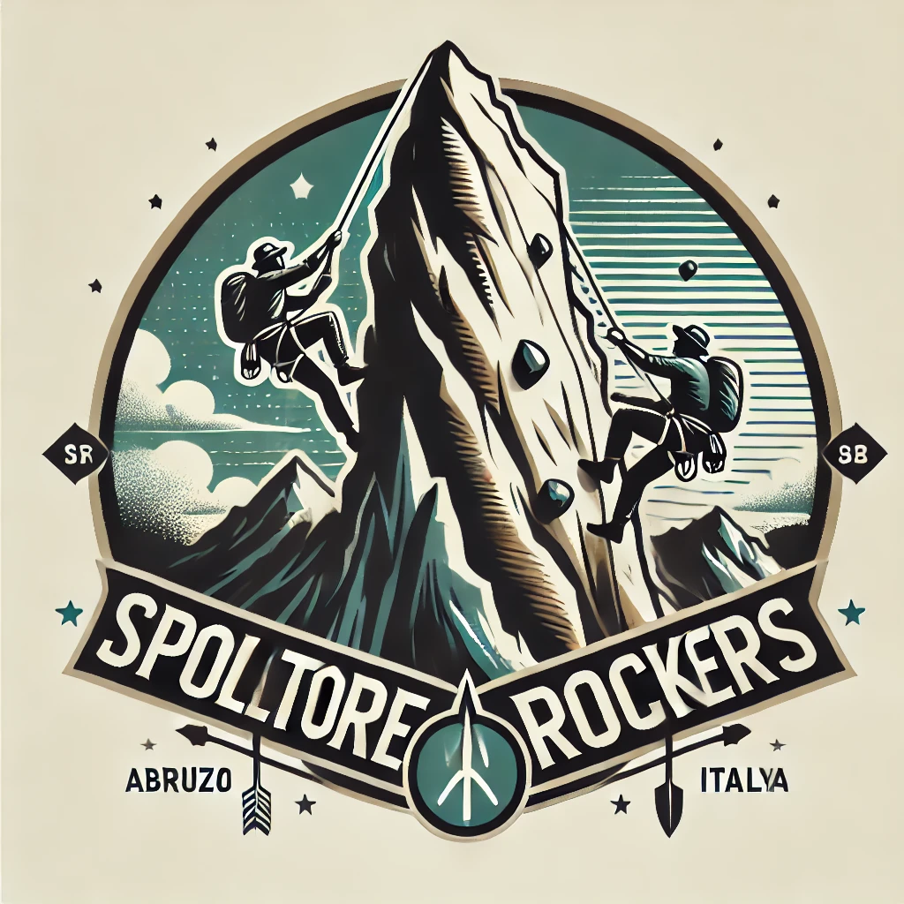

# Spoltore Rockers

Benvenuti nel sito ufficiale di **Spoltore Rockers**! Questo progetto celebra la passione per l'arrampicata e la bellezza naturale di Spoltore e dintorni, offrendo informazioni, eventi e risorse per gli appassionati di outdoor e avventura.

🌐 **Visita il sito web**: [https://spoltorerockers.netlify.app/](https://spoltorerockers.netlify.app/)

## Tecnologie Utilizzate

- **Framework**: L'applicazione è sviluppata utilizzando [Svelte](https://svelte.dev/) e [SvelteKit](https://kit.svelte.dev/), un moderno framework per la creazione di applicazioni web reattive e performanti.
- **Hosting**: Il sito è ospitato su [Netlify](https://www.netlify.com/), garantendo velocità e affidabilità.
- **Stile**: La grafica e i colori sono stati progettati per riflettere un'estetica professionale e moderna, utilizzando SCSS per la gestione degli stili.

Grazie per il vostro interesse in Spoltore Rockers! 🌄